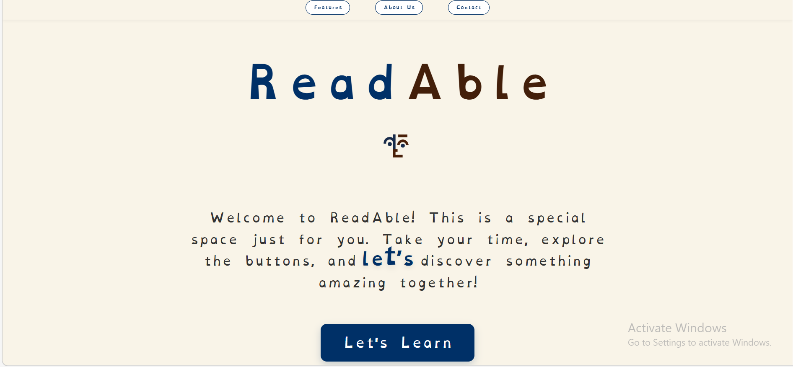

# 📖 ReadAble: Interactive Dyslexia Support Platform

**ReadAble** is an accessibility-focused web application engineered to empower learners with dyslexia, dysgraphia, and dyscalculia. By merging specialized typography with interactive "Learning Labs," the platform transforms reading into a controlled, personalized experience that reduces visual stress and cognitive load.

---

## 🚀 Key Features & Learning Modes

### 1. The 10-Step Diagnostic Test
A foundational assessment that identifies specific learning barriers. The results dynamically unlock a personalized learning path.

### 2. Specialized Learning Labs (Customized Tasks)
* **⚡ Visual Lab**: Features **Letter Trace** for commonly flipped letters and **Shape Match** for geometric recognition.
* **📖 Sound Lab**: Includes **Story Telling** at 0.6x speed and a **Rhyme Game** for phonological awareness.
* **📏 Focus Lab**: Employs a **Digital Reading Ruler** and **Letter Hunt** to train eye-tracking and scanning.

---

## 🛠️ Technical Implementation

* **Dyslexia-First Design**: Implements the **OpenDyslexic** font and a custom **"Letter Bulge"** hover effect to aid tracking.
* **Responsive Architecture**: Built with **HTML5/CSS3** using **vh/vw** units for layout integrity.
* **Performance**: Uses **Vanilla JavaScript** and **LocalStorage** to manage user results without a backend.

---

## 👥 Meet the Creators
**Created with 💙 by Devasangeethi S & Annmaria A Arampulickal**
*Computer Science Students | Kerala, India*

