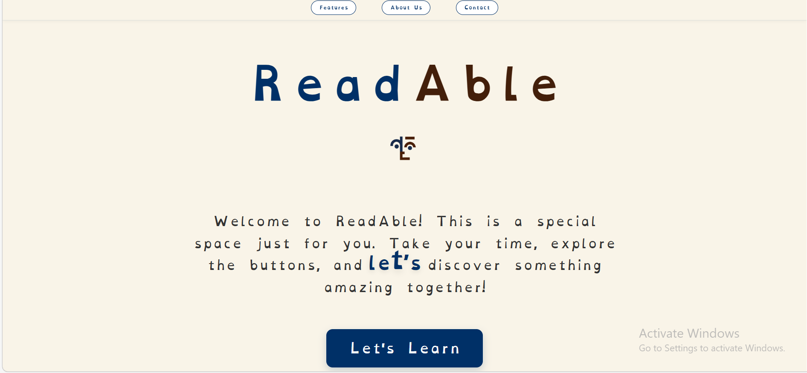
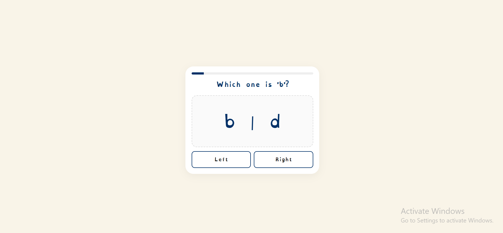
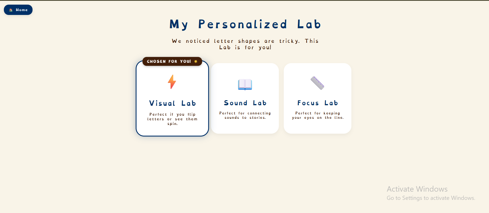
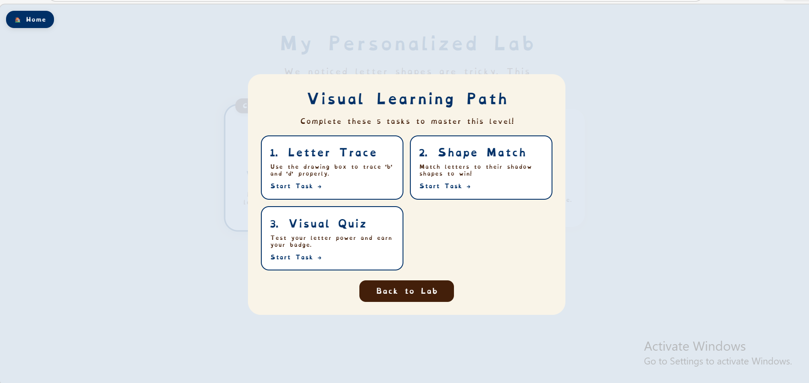
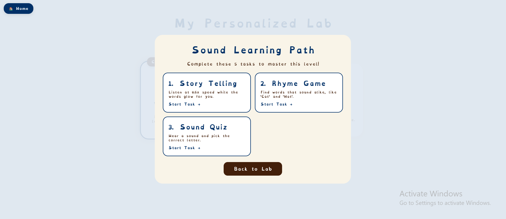
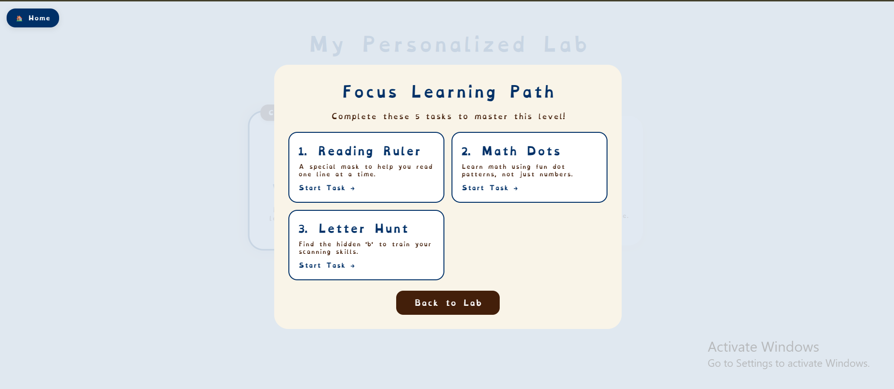

# ReadAble 🎯
> **Empowering Every Learner, One Character at a Time.**


## Basic Details
**Team Name**: [ERRORS]

**Team Members**:
* **Member 1**: Devasangeethi S - [Model Engineering College]
* **Member 2**: Annmaria A Arampulickal - [Model Engineering College]

**Hosted Project Link**:
[https://readable-mu.vercel.app](https://readable-mu.vercel.app)

## Project Description
ReadAble is a cognitive support web application engineered to empower learners with dyslexia, dysgraphia, and dyscalculia. The platform utilizes a specialized Diagnostic Engine to identify specific learning barriers—such as visual stress and character rotation—and dynamically generates a personalized dashboard of Visual, Sound, and Focus Labs to reduce cognitive load and improve reading outcomes.

## The Problem Statement
In our society, children who struggle to keep up in the classroom are often unfairly labeled as "slow" or "fools" because they cannot read at the same speed as their peers. Without proper guidance or specialized tools, these bright students lose their self-confidence and feel like they don't belong, simply because the world isn't designed for their way of learning.

The root of this struggle is often Dyslexia, which causes letters on a standard digital screen to "jump," blur, or flip (such as turning a 'b' into a 'd'). This makes reading an exhausting and frustrating task, leaving them behind in a fast-paced digital world with no one to guide them through these invisible barriers.

## The Solution
ReadAble acts as the digital guide that these students have been missing. Instead of forcing children to adapt to a broken system, our platform adapts to them. By using a personalized Diagnostic Engine, we identify exactly how a child sees text and then transform the screen into a supportive learning environment.

How ReadAble Guides the Learner:

**Visual Lab**: Fixes "letter-flipping" by using OpenDyslexic fonts (weighted at the bottom to stay grounded) and interactive character-tracing.

**Focus Lab**: Stops "line-jumping" with a Digital Reading Ruler that highlights one line at a time, keeping the child on track.

**Sound Lab**: Assists those who feel "slow" by syncing text with slowed-down audio (0.6x), helping them connect sounds to letters at their own pace.

---

## Technical Details
### Technologies/Components Used

* **Languages used**: HTML5, CSS3, JavaScript (ES6+)
* **Libraries used**: Web Storage API (LocalStorage)
* **Tools used**: VS Code, Git, GitHub, Figma, Vercel

## Features
* **Feature 1: Diagnostic Engine** - A specialized assessment that identifies a student's specific reading barriers, like letter-flipping or line-jumping, to create a personalized user profile.
  
* **Feature 2: Focus Lab** - Features a Digital Reading Ruler that masks surrounding text and highlights one line at a time to prevent visual distraction and "losing your place.
  
* **Feature 3:Visual Lab** – Uses OpenDyslexic weighted fonts and interactive tracing to "ground" characters, preventing the mental rotation of letters like 'b' and 'd'.
  
* **Feature 4: Sound Lab** – Provides synchronized audio storytelling at 0.6x speed, helping learners who feel "slow" to map sounds to letters at their own comfortable pace.

---

## Implementation
### Installation
```bash
git clone [https://github.com/devae0/ReadAble_Project.git](https://github.com/devae0/ReadAble_Project.git)
cd ReadAble_Project
```
### Navigate to the Directory
```bash
cd ReadAble
```
### Run Commands
Simply locate the index.html file in your project folder and open it directly in any modern web browser (Chrome, Edge, or Firefox).

## Project Documentation
### Screenshots







### Project Demo
## Video
You can watch the full walkthrough of **ReadAble** and its features here:

**[👉 Click here to watch the ReadAble Demo Video](https://drive.google.com/file/d/1JRU6IwTo1bkvUuCri7YxB1UCY9nNAaJS/view?usp=drive_link)**

### Team Contributions
* **Devasangeethi S**:UI/UX Design (Figma), Landing Page development, Diagnostic Engine assessment logic, Feature content development, and Project Documentation.
*  **Annmaria A Arampulickal**: Game development for each Lab, interactive learning mechanics, and game-specific UI implementation.

### License

